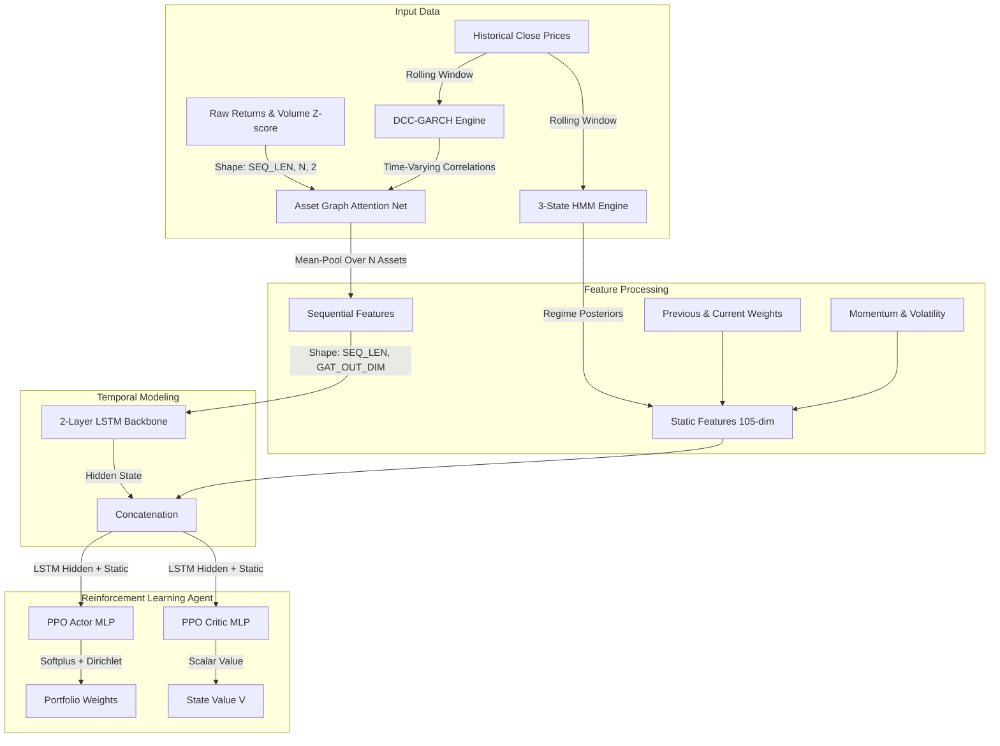

# ZenithPortfolio-RL: Deep Reinforcement Learning for Constrained Portfolio Optimization with DCC-GARCH-GAT and HMM Regimes

[](https://www.python.org/)
[](https://pytorch.org/)
[](https://opensource.org/licenses/MIT)

**ZenithPortfolio-RL** is an advanced, production-grade deep reinforcement learning framework designed to solve constrained portfolio optimization problems. By combining dynamic statistical models, graph neural networks, and risk-sensitive reinforcement learning, this project achieves superior risk-adjusted returns while strictly satisfying downside tail-risk constraints (CVaR).

The architecture integrates **DCC-GARCH** dynamic correlation modeling, a custom multi-head **Asset Graph Attention Network (AssetGAT)**, **Hidden Markov Model (HMM)** market regime classification, and a **Proximal Policy Optimization (PPO)** agent trained under an **Augmented Lagrangian Method (ALM)**.

---

## 🗺️ System Architecture

The network processes multi-modal inputs at each timestep, combining sequential asset metrics with dynamic graph relations and global market state indicators.



---

## 🌟 Key Features & Evolution

| Feature | Version 2 (`rl_portfolio_v2.py`) | Version 3 (`rl_portfolio_v3.py`) |
| :--- | :--- | :--- |
| **Asset Universe** | 5 Assets (Equities only) | **10 Assets** (Equities, Bonds, Gold, Small-Cap, International) |
| **Asset Relations** | Static or Flattened inputs | **Dynamic DCC-GARCH Correlation Matrix** as Graph Edges |
| **Network Architecture** | Standard LSTM Backbone | **AssetGAT (Graph Attention)** enriches embeddings before LSTM |
| **Regime Awareness** | None | **3-State Rolling HMM** posterior appended to static features |
| **Algorithms** | PPO + TD3 | **PPO + CVaR Only** (cleaner, robust constraint foundation) |
| **GPU Optimizations** | TF32, AMP, Pinned Memory | **Pre-staged GPU Adjacency Tensors** (zero CPU lookup overhead) |

---

## 🧮 Mathematical Formulation

### 1. Risk-Sensitive Reward Function
The agent seeks to maximize transaction-cost-adjusted returns while penalizing variance and tail-risk violations:
\[R_t = r_{p, t} - \beta \sigma_{p, t}^2 - \xi \text{TC}_t - \text{Penalty}_{\text{CVaR}}\]

Where:
- \(r_{p, t} = \mathbf{w}_t^T \mathbf{r}_t\) is the portfolio return.
- \(\sigma_{p, t}^2\) is the rolling portfolio variance.
- \(\text{TC}_t = \xi \sum_{i=1}^{N} |w_{t, i} - w_{t-1, i}|\) is the transaction cost.

### 2. CVaR Tail-Risk Constraint
Conditional Value-at-Risk (CVaR) is constrained to be below a threshold \(\zeta\):
\[\text{CVaR}_\alpha(R_p) \le \zeta\]

Using the auxiliary variable formulation (Rockafellar & Uryasev), the violation metric \(C\) is computed as:
\[C = \nu + \frac{1}{1-\alpha} \mathbb{E}\left[\max(0, -R_p - \nu)\right] - \zeta\]

### 3. Augmented Lagrangian Method (ALM)
The constraint is enforced during training via the Augmented Lagrangian loss:
\[\mathcal{L}_{\text{ALM}}(C) = \lambda C + \frac{\rho}{2} C^2\]

During rollouts, parameters \(\lambda\) (multiplier) and \(\rho\) (penalty scale) are dynamically updated to drive violations to zero.

---

## 📊 HMM Regime Detection
The rolling HMM classifies market conditions into three distinct states based on volatility, pairwise asset correlation, and cross-sectional dispersion:
- **State 0: Bull Regime** (Low Volatility)
- **State 1: Bear Regime** (Moderate Volatility)
- **State 2: Crisis Regime** (High Volatility)

This allows the policy network to dynamically re-weight allocations depending on the prevailing market regime.

---

## 🛠️ Performance & GPU Acceleration
Optimized for high-performance training on modern hardware (e.g., RTX 4070 + Intel i9):
- **Tensor Core Acceleration**: TF32 matmuls and Automatic Mixed Precision (AMP) `float16` training.
- **Model Compilation**: Compiles the backbone and actor/critic networks via `torch.compile(mode="reduce-overhead")` for faster execution graphs.
- **Zero-Copy Adjacency**: Dynamic DCC-GARCH correlation matrices are pre-computed and staged onto the GPU VRAM as a single `(T, SEQ_LEN, N, N)` tensor, bypassing CPU-GPU transfer bottlenecks during training.
- **Vectorized Environments**: Multi-threaded `ThreadedVecEnv` runs parallel rollout environments to saturate GPU utilization.

---

## 🚀 Getting Started

### 📋 Prerequisites
Install CUDA-enabled PyTorch and other statistical modeling libraries:
```bash
pip install torch torchvision torchaudio --index-url https://download.pytorch.org/whl/cu124
pip install yfinance numpy pandas matplotlib arch hmmlearn
```

### 🏃 Running Training & Evaluation
To run the model training (which trains the PPO agent, tracks the CVaR constraints, performs backtesting on the test set, and generates a PDF report):

```bash
python "rl_portfolio_v3 (3).py"
```

---

## 📂 Codebase Contents
- `rl_portfolio_v3 (3).py`: The main pipeline incorporating the DCC-GARCH-GAT architecture, HMM regimes, PPO+CVaR engine, and vectorized environment.
- `rl_portfolio_v2 (2).py`: The predecessor version (LSTM backbone with PPO/TD3 baseline).
- `rl_portfolio_report_v3 (2).pdf`: Sample backtesting and training report.
